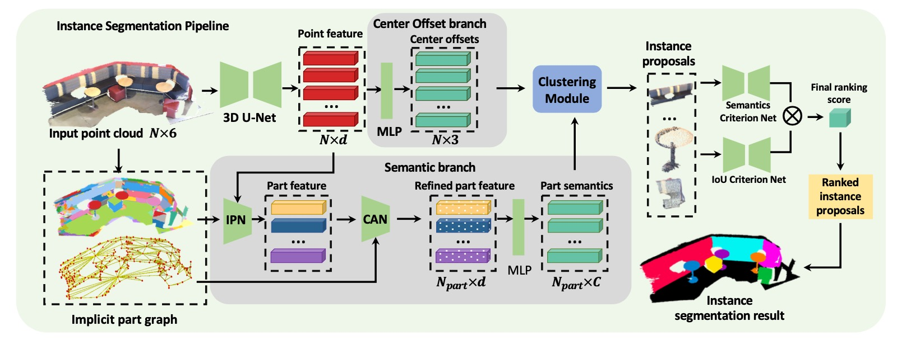

# IPCA
## Implicit-Part Based Context Aggregation for Point Cloud Instance Segmentation
Code for the paper **Implicit-Part Based Context Aggregation for Point Cloud Instance Segmentation**, IROS 2022.



## Installation
1.  Base environment
Refer to [PointGroup](https://github.com/dvlab-research/PointGroup) for envirinment construction.


2. PointNet++
```bash
cd lib/pointnet2
python setup.py install
```

3. DGL
Install DGL according to https://github.com/dmlc/dgl


## Data Preparation
1. Download ScanNet and unzip it into `dataset/scannetv2/train_normal_seg` and `dataset/scannetv2/val_normal_seg`
2. run the following commands:
```bash
cd dataset/scannetv2/
bash gen_data_with_normal_color_seglabel.sh
```
3. Generate implicit part graph
```bash
cd dataset/scannetv2
python implicit_part_graph.py  # modify dataset root first
```

## Model Description
- Base model: pointgroup/pointgroupleaky.py
- Base model + IPCA: seggroup/segspgsemleaky.py
- Base model + IPCA + SCN: seggroup/segspgsemleakysemscore.py

## Training
Since the training process is time consuming, we initialize our model with a pretrained base model to speed up the training process.
You can download our trained models from [Google Drive](https://drive.google.com/drive/folders/1M9RXUjexeshwXGp3J98JV5VmicG-HFTq?usp=sharing) and move them to `pretrained_models/`.

1. Train base PointGropu model
```bash
python train.py --config config/pointgroupleaky_run1_scannet.yaml
```

2. Train with IPCA module (parameters initialized from base model).
```bash
python train.py --config config/segspgsemleaky_run1_scannet.yaml
```

3. Train the full model with IPCA and SCN module  (parameters initialized from IPCA model).
```bash
python train.py --config config/segspgsemleakysemscore_run1_scannet.yaml
```


## Evaluation
1. Test Base model (PointGroup):
```bash
python test.py --config config/pointgroupleaky_run1_scannet.yaml --pretrain pretrained_models/pointgroupleaky_run1_scannet-000000512.pth
```
You should get the following results:
```txt
################################################################
what           :             AP         AP_50%         AP_25%
################################################################
cabinet        :          0.364          0.592          0.725
bed            :          0.494          0.756          0.815
chair          :          0.724          0.867          0.906
sofa           :          0.414          0.657          0.816
table          :          0.493          0.700          0.812
door           :          0.271          0.459          0.558
window         :          0.313          0.489          0.688
bookshelf      :          0.234          0.429          0.580
picture        :          0.263          0.422          0.503
counter        :          0.097          0.251          0.583
desk           :          0.181          0.437          0.758
curtain        :          0.303          0.511          0.633
refrigerator   :          0.342          0.458          0.493
shower curtain :          0.492          0.681          0.848
toilet         :          0.854          0.982          0.999
sink           :          0.435          0.723          0.860
bathtub        :          0.647          0.837          0.871
otherfurniture :          0.402          0.595          0.687
----------------------------------------------------------------
average        :          0.407          0.603          0.730
```


2. Test our full model:
Download our trained models from [Google Drive](https://drive.google.com/drive/folders/1M9RXUjexeshwXGp3J98JV5VmicG-HFTq?usp=sharing) and move them to `pretrained_models/`.

```bash
python test_semscore.py --config config/segspgsemleakysemscore_run1_scannet.yaml --pretrain pretrained_models/segspgsemleakysemscore_run1_scannet-000000192.pth
```
You should get the following results:
```txt
################################################################
what           :             AP         AP_50%         AP_25%
################################################################
cabinet        :          0.391          0.614          0.765
bed            :          0.550          0.786          0.871
chair          :          0.750          0.887          0.929
sofa           :          0.494          0.740          0.882
table          :          0.555          0.768          0.864
door           :          0.335          0.549          0.647
window         :          0.369          0.549          0.742
bookshelf      :          0.313          0.550          0.673
picture        :          0.493          0.586          0.660
counter        :          0.176          0.360          0.677
desk           :          0.268          0.591          0.835
curtain        :          0.346          0.526          0.659
refrigerator   :          0.543          0.665          0.732
shower curtain :          0.599          0.768          0.867
toilet         :          0.910          0.981          0.981
sink           :          0.551          0.804          0.900
bathtub        :          0.691          0.805          0.870
otherfurniture :          0.485          0.648          0.740
----------------------------------------------------------------
average        :          0.490          0.676          0.794
```

## Citation
If you find this work useful in your research, please cite:
```txt
@inproceedings{iros2022/ipca,
  author    = {Xiaodong Wu and
               Ruiping Wang and
               Xilin Chen},
  title     = {Implicit-Part Based Context Aggregation for Point Cloud Instance Segmentation},
  booktitle = {{IEEE/RSJ} International Conference on Intelligent Robots and Systems,
               {IROS} 2022},
  publisher = {{IEEE}},
  year      = {2022},
}
```


## Acknowledgement
This repo is built upon [PointGroup](https://github.com/dvlab-research/PointGroup), [Pointnet2.PyTorch](https://github.com/sshaoshuai/Pointnet2.PyTorch), [superpoint_graph
](https://github.com/loicland/superpoint_graph).
